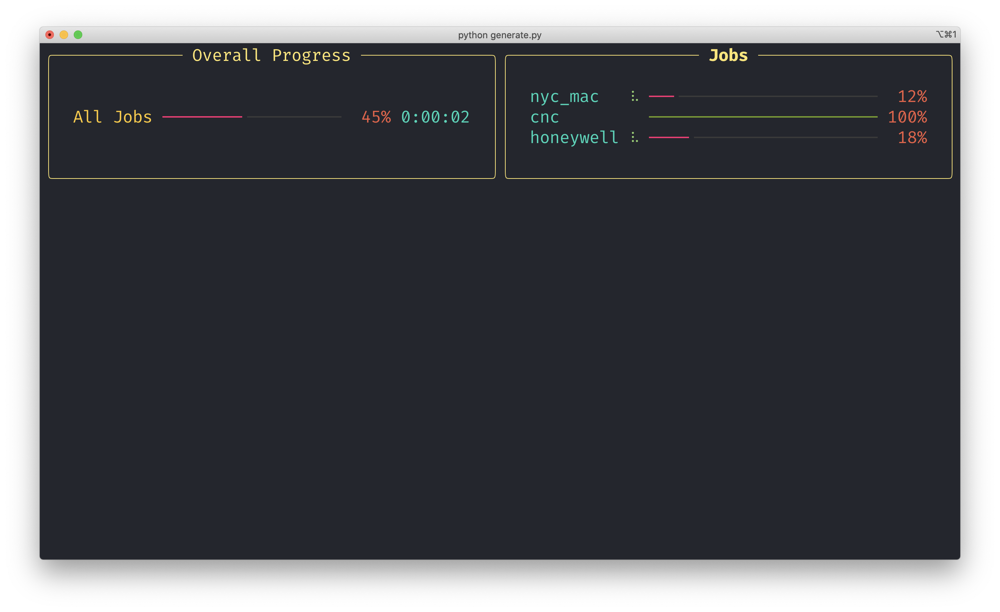
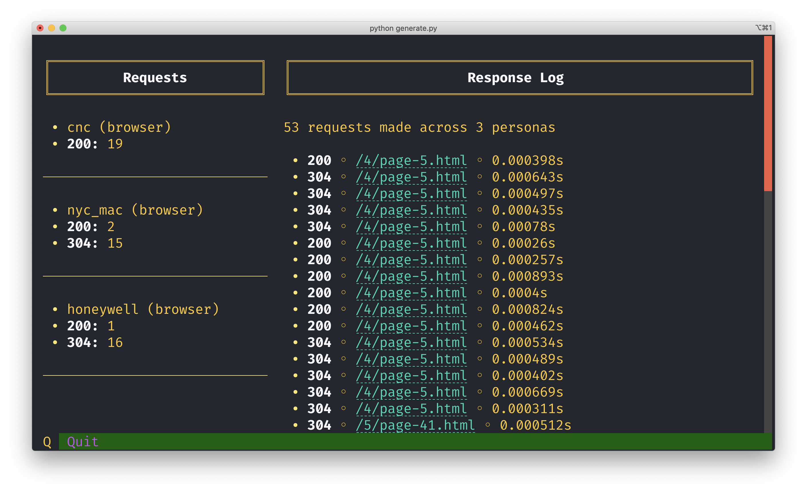

# Fake traffic generator for Gartner Demo

Generate fake traffic to URLs with custom user-agents

## Usage




**Tested with Python 3.9.5 and pip 22.0.3 on MacOS 10.15.7**

I highly recommend you always run each Python project within its own virtualenv. The commands below assume you have already created and activated a virtualenv for this project.

```
git clone git@github.com:newrelic-experimental/fake-user-agent-traffic-geneator.git
cd fake-user-agent-traffic-geneator
pip install -r requirements.txt
python generate.py
```

## Config

Configuration is done via the `config.toml` file.

### Global settings

| Name        | Type      | Description            |
| ----------- | --------- | ---------------------- |
| concurrency | int       | max asyncio primitives |
| urls        | list[str] | List of URLs to target |

Request specific settings are grouped together into Personas, you can create as many personas as you would like for each run.

| Name           | Type                 | Description                                                                  |
| -------------- | -------------------- | ---------------------------------------------------------------------------- |
| browser        | bool                 | Use a headless browser for these requests (required for RUM)                 |
| min_requests   | int                  | Minimum number of requests to make per URL                                   |
| max_requests   | int                  | Maximum number of requests to make per URL                                   |
| timeout        | int                  | Request timeout in seconds                                                   |
| cache_enabled  | bool                 | Enable browser cache (only used when browser=true)                           |
| user_agents    | list[str]            | User-Agent strings to use. A random ua will be choosen per request           |
| custom_headers | list[list[str, str]] | Any other headers to send with the request. See the example below for syntax |
| color          | str                  | Persona text color in progress bar                                           |

Each custom header must be a list where index 0 is the header key and index 1 is the header value. For example:

`custom_headers = [["X-Script-Version", "v0.0.1"], ["X-Something-else", "abc"]]`
